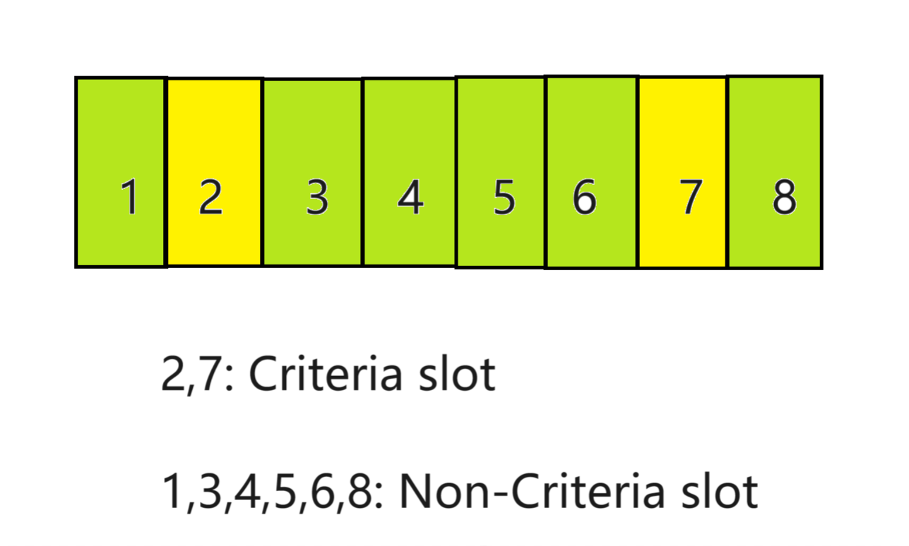

# Password Generator

## My Repo Link: https://github.com/Jason897571/Challenge_1
## Link to My Website: https://jason897571.github.io/Challenge_1/

## Description
### It is a password generator to insure the security of your account. This tool randomly generate a strong password based on the rule you choose.

## User Input
### firstly, you need to choose how long the password is in the prompt. If the input is less than 8 or more than 128, the user need to input again until a vaild length is input.
### secondly, you need to choose whether the password should include lowercase,uppercase,numeric or special characters. if no criteria are choosen, the user need to choose at least one.

## How it works?

### Criteria Slot: The slot picks up a character from a single criteria string, such as lowercase,uppercase,numeric or special.
### Non-Criteria Slot: the slot picks up a character from a combined criteria string where lowercase,uppercase,numeric or special are included

### Step 1: This tool will determine which slot should be taken for criteria slot.
### Step 2: Pick up a letter from a single criteria string for criteria slot.
### Step 3: Pick up a letter from the combined criteria string for non-criteria slot.
### Step 4: combine all criteria slot and non-criteria slot to generate a password

## Example

### given the user choose 8-character password and lowercase and numeric rules are selected
### the tool will determine the Criteria slot which are 2 and 7 in the picture.
### Then tool will randomly select a letter for slot 2 from "abcdefghijklmnopqrstuvwxyz" and a letter for slot 7 from "123456789". This will insure that the password must include lowercase and numeric character.
### Then the tool will randomly choose a letter for slot 1,3,4,5,6,8 from the combined criteria string "abcdefghijklmnopqrstuvwxyz123456789".
### Lastly, a passwrod will be generated.

